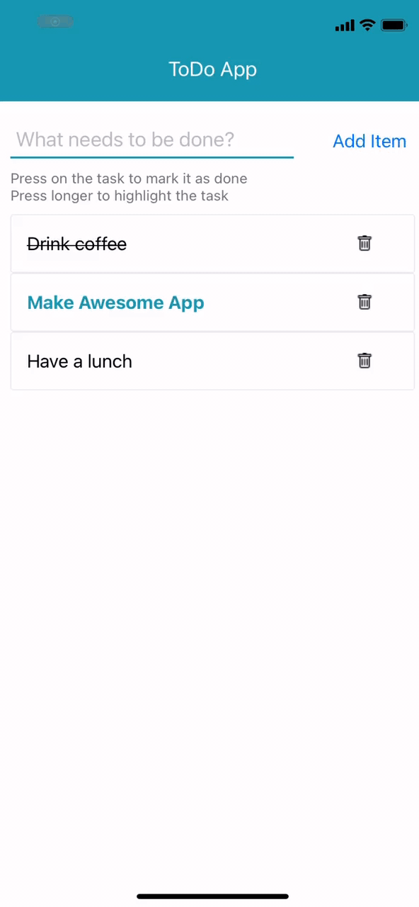

# Star Wars Reference Guide

This is the repository of ToDo Application created by using React Native

## Demo



## Built with
* React Native
* EXPO
* NPM

## How to Use
In order to run this application you will need installed git and NodeJS

```
# Clone this repository
$ git clone git@github.com:artoryas/starwars_angular.git

# Open the repository
$ cd starwars_angular

# Install dependencies
$ npm install

# Run the app and scan QR code offered by EXPO using your phone
$ expo start
```


